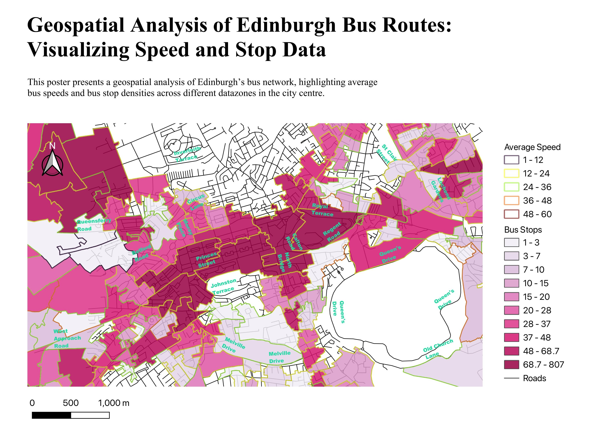

# Geospatial-Data-Analysis

This project presents a geospatial analysis of Edinburgh's bus network, focusing on average bus speeds and the distribution of bus stops across various datazones.

## Tools Used: 

* QGIS for spatial data analysis and visualization
* PostgreSQL for database management and queries

## Visualization

This visualization aids urban planners and policymakers in understanding public transit dynamics, helping to identify areas for improvement and optimize the bus network for better accessibility and efficiency.
 
